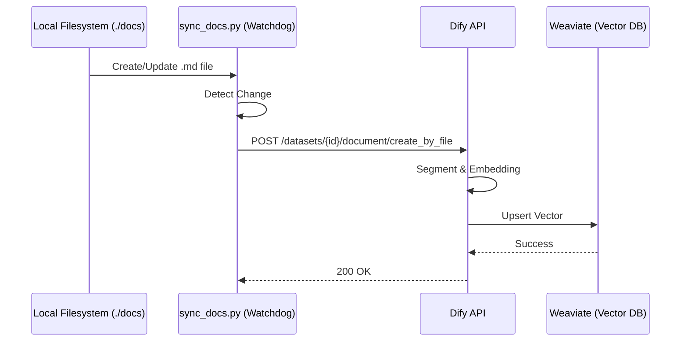
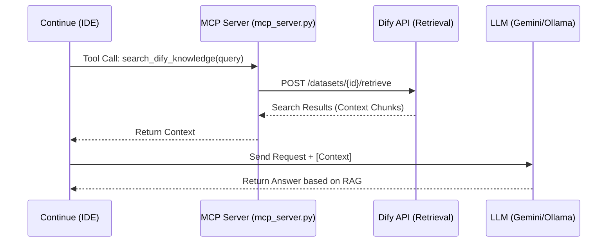

## 1. はじめに

こんにちは。最近もよくわからないSES企業で日々Excelを開いているカスエンジニアです。
今日は自社が「RAGとエージェントが統合されたアプリが欲しい」とほざいていたので色々調べて設計したら、「Claudeのエンタープライズプランでいい」とか言い出してムカついたので、元の設計を大幅にダウングレードして個人用に作り替えた話をしようと思います。

ことのきっかけは、自社が新しく案件を持ってきて、その開発用にエージェントが使いたい、かつ、案件のドキュメントを見るためのRAGが欲しいと言い始めたことにあります。
個人でRAGを使いたいならNotebookLMがかなり優秀ですよね。しかし、案件のドキュメントとなると機密情報を使うのであまりどこかにアップロードしたりするのは憚られます。
また、今のNotebookLMはAPIが提供されておらず、ドキュメントの追加更新、エージェントとの協働みたいなところがちょっと手間ですよね。かく言う私もNotebookLMを活用してはいましたが、検索をかけてその回答をエージェントにコピペして…ということをしていました。

今回ページの要望を機に、自分でRAGとコーディングエージェントが協働できるアプリを作ろうと思ったのが設計のきっかけです。
ただ、ここで設計したのはエンタープライズ向けということもあって、AWSを使ったかなり大規模なものでした。それをいらないと一蹴されてしまったので、涙をこらえて個人用にダウングレードしました。

作ってみて色々反省点や改善点、逆に良かった点も見つかったので備忘として残したいと思います。よければお付き合いください。

---

## 2. 怒りの個人用ローカルAI基盤「ragy」の全体像

会社向けに考えていた「VPCがどうの」とか「可用性がどうの」という重苦しい要件は全部窓から投げ捨てました。
個人開発で欲しいのは、ターミナルから一歩も出ずに、フォルダにMarkdownを置いたら勝手にAIが文脈を理解してコードを書いてくれるという、極限まで怠惰になれる魔法の環境です。

とはいえ、セキュリティやモデルの取り回しは妥協したくなかったので、Difyをコアにしつつ以下のような構成に落ち着きました。


ざっくり言うとこんな感じです。

1. **ハイブリッドLLM (LiteLLM)**：メインのコーディングにはGeminiを使用し、ローカルでの処理やチャットにはQwen2.5-Coderを、RAG検索のベクトル化には埋め込みモデル（multilingual-e5-large）を裏側で投げ分ける。エディタ側からは単一のOpenAI互換APIに見えるように偽装。ContinueやAiderだけでなく、OpenAI互換APIに対応した任意のツール（最近話題の `pi` や `opencode` など）からも、エンドポイントとAPIキーを合わせるだけでそのまま接続・利用可能です。
2. **全自動RAG同期 (Watchdog)**：プロジェクトの `docs/` にファイルを置くだけでDifyのナレッジとリアルタイム同期。ブラウザを開くという石器時代の操作は撲滅。
3. **自己修復エージェント**：エラーログを監視して、例外を吐いたらAIエージェントがエラーログとソースコードの文脈から修正内容を自律的に判断し、パッチを当ててPRを出す。
4. **SSRF防御**：DifyのSandboxが暴走してローカルネットワークを荒らさないようにSquidプロキシで蓋をする。


### ドキュメント登録シーケンス



### RAG検索シーケンス



---

## 3. アーキテクチャ的な工夫とAIとの協働開発

今回の個人用AI基盤「ragy」を構築するにあたり、一番驚いたのは「思ったよりも簡単に、かつ爆速で動くものが完成した」ということです。

もちろん、基本となるアーキテクチャの骨格（LiteLLMゲートウェイでの投げ分け、Dify APIを叩く自動同期、Redisを用いたMCPセマンティックキャッシュ、SquidプロキシによるSSRF防御などの連携設計）は私自身が頭をひねって考えました。

しかし、実際のPythonコードやシェルスクリプトの書き下ろし、設定ファイルの整備といった泥臭い実装部分は、**ほぼすべて開発AIアシスタント（Antigravity）に丸投げ**しました。

私がやったことといえば、
「こういうアーキテクチャで動かしたいから、監視用のPythonスクリプトを書いて」
「Dify APIのこの仕様に合わせて、設定情報をJSONでパッキングする実装にして」
と指示を投げただけです。

AIエージェントの自律的なコーディング能力のおかげで、人間側は「システム設計と指示」に100%専念でき、環境構築にかかった実質的な時間はわずか数日でした。アーキテクチャの設計図さえ正しく描ければ、実装はAIとペアプログラミングすることで、個人の開発効率を何倍にも引き上げられる時代が来ていると痛感しました。

---

## 4. 開発プロセスで立ちはだかったOSやプロセスの罠

とはいえ、AIに実装を丸投げする中で、OSの挙動やシグナル周りの「AIが一人では解決しづらい低レイヤーの怪現象」にぶち当たり、そこについてはAIと何度もログを突き合わせて格闘することになりました。

### ① macOSにおけるマルチスレッド環境下での `fork` 制限

バックグラウンド同期やWebhookリスナーをデーモンプロセスとして常駐させようとした際、Pythonの `os.fork()` を使った一般的なデーモン化コードをAIが書きました。しかし、これがmacOS (Darwin) 環境で動かした途端に `SIGABRT` で即時強制終了される現象が発生しました。
macOSの仕様で、マルチスレッド環境下（Uvicorn実行時など）での安全性の観点から `fork` が厳しく制限されているのが原因でした。
これに対し、AIと相談して `subprocess.Popen` に `start_new_session=True` を指定することで、fork制限を完全にバイパスしつつ、親の強制終了シグナルが伝播しない完全な独立デーモンとして動かす手法にたどり着きました。

### ② 自動デプロイWebhookの「シグナル連鎖死」問題

GitHubへのプッシュをトリガーに、自動的に最新ソースをプルしてシステムを再起動する `deploy_listener.py` を実装したのですが、初期の実装では再起動コマンド（`ragy restart`）を実行した瞬間に、再起動をトリガーしたはずのレシーバープロセスが巻き添えで強制終了され、デプロイ処理自体が途中で消滅してしまいました。
原因は、親プロセスが子プロセスツリー全体を道連れにしてクリーンアップするシグナル（SIGHUP等）の連鎖死でした。
これには、

- デプロイ再起動時に `AUTO_DEPLOY=1` という環境変数を付与してキル処理をスキップさせる
- Webhookレシーバー自身がHTTPレスポンスを返した直後に `os._exit(0)` で自ら潔く死に、ポートを解放する
といった、OSのプロセス管理とシグナルの挙動を細かく制御する泥臭いデバッグをAIと繰り返すことで、ようやく安定稼働に漕ぎ着けました。

---

## 5. 作って気づいた後悔：密結合の限界

とりあえず最速で動くものを作ってv1.1.0としてリリースし、感動も味わったのですが、冷静に運用してみると自分の浅はかさを呪うことになりました。
Aiderなどのエージェントが、DifyのRAG APIを直接叩くという完全同期型の密結合アーキテクチャにしてしまったのです。

これの何がヤバいかというと、以下の2点に尽きます。

### ① RAGが死ぬとエージェントも道連れになる

Difyコンテナが再起動中だったり、Weaviateがインデックス作成で息継ぎをしている時にエージェントがリクエストを投げると、容赦なくタイムアウトしてエージェント側もクラッシュします。
エージェント君には「RAGが忙しいならとりあえずローカルのファイル見て作業進めといてよ」と言いたいのに、RAGと運命を共にする仕様になっていました。
作業しながらContinueが出すエラーのポップアップをよく見ました...

### ② AIの反省を促せない

APIで直接やり取りして完結してしまうため、中間に介入して「エージェントがRAGに投げた検索クエリ、ちょっとアホじゃない？」とか「RAGが返ってきたコンテキスト、絶対これじゃないだろ」とツッコミを入れる隙がありませんでした。

早く動かしたいという都合で作った結果、拡張性や耐障害性が犠牲になっていたわけです。AWSの重厚な設計を考えていたはずなのに、ローカルに落とし込んだ途端にこのザマです。

---

## 6. 今後の展望（v2.0）：RedisキューとDifyワークフローによるSelf-RAGのハイブリッド自律化

この密結合の壁をぶち壊し、さらにRAGの精度を爆上げするために、次はRedisをメッセージングキューとして挟む非同期アーキテクチャと、Difyの「ワークフロー機能」を組み合わせたSelf-RAGへの進化を企んでいます。

直接Dify APIとやり取りするのをやめ、全ての検索依頼を非同期のイベントとして一度Redisキューに投げます。

```text
[Aider / Continue] ──(MCP API)──► [ MCP Server ]
                                       │
                                       ▼
                                 [ Redis Queue (Streams) ] ◄─────► [ agent_healer ]
                                       │
                                       ▼
                                 [ Queue Worker ]
                                       │
                                       ▼ (Dify ワークフロー API)
                       [ Dify Workflow (Self-RAG) ]
                        ├─ クエリ再生成 / 最適化
                        ├─ ナレッジ検索 (Weaviate)
                        └─ Evaluatorによる自己評価 (不十分なら再検索)
```

### なぜLangGraphではなくDifyワークフローなのか？

RAGの高度なループ処理（Self-RAGなど）の実装といえばLangGraphが有名ですが、あれを個人開発でフルスクラッチ導入すると、チャンキングやベクトルDB管理などのインフラもすべてコードで保守するハメになり、開発コストが爆発します。
そこで、インフラ面はDifyの強力なナレッジ管理機能をそのまま活かし、高度なループ制御（検索クエリの最適化 → 検索 → 検索結果の評価 → ダメならクエリを動的修正して再検索）は、Difyの「ワークフロー機能」で実装するというハイブリッド作戦をとります。

中間にRedisキューを挟んでイベント駆動化することで、Difyが落ちていてもリクエストはキューに溜まるため、エディタ側のエージェントがクラッシュして作業が中断されることもなくなります。個人用アプリとはいえ、ここまでやれば極めて堅牢で自律的なローカルAI基盤です。

---

## 7. おわりに

会社に要件を一蹴された時は本当にムカつきましたが、結果として「自分が一番欲しい、ターミナル完結型のAI開発基盤」を、自ら考えたアーキテクチャとAIアシスタントの圧倒的な実装スピード、そしてOSの仕様課題と格闘しながら作れたのは、エンジニアとして最高の暇つぶし（と勉強）になりました。

業務で作る重厚なシステムもいいですが、自分のためだけにアーキテクチャをこねくり回して、AIに実装させて、失敗して、また設計し直すプロセスはやはり楽しいものです。

もし私と同じように、よくわからないSES企業でExcelを開きながら「本当はもっとモダンな環境でコード書きたいんだよ！」と燻っているエンジニアがいれば、ぜひ自分のローカル環境だけでも最強のAI基盤を構築してみてください。

最後まで読んでいただき、ありがとうございました！
